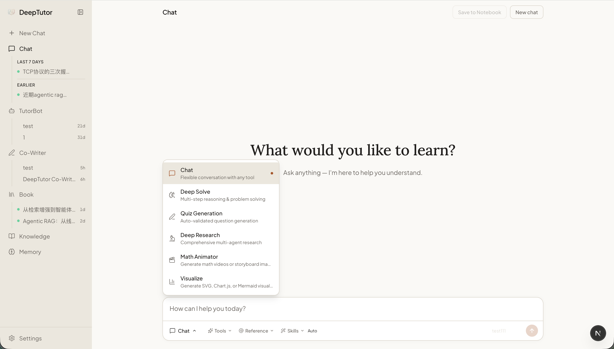
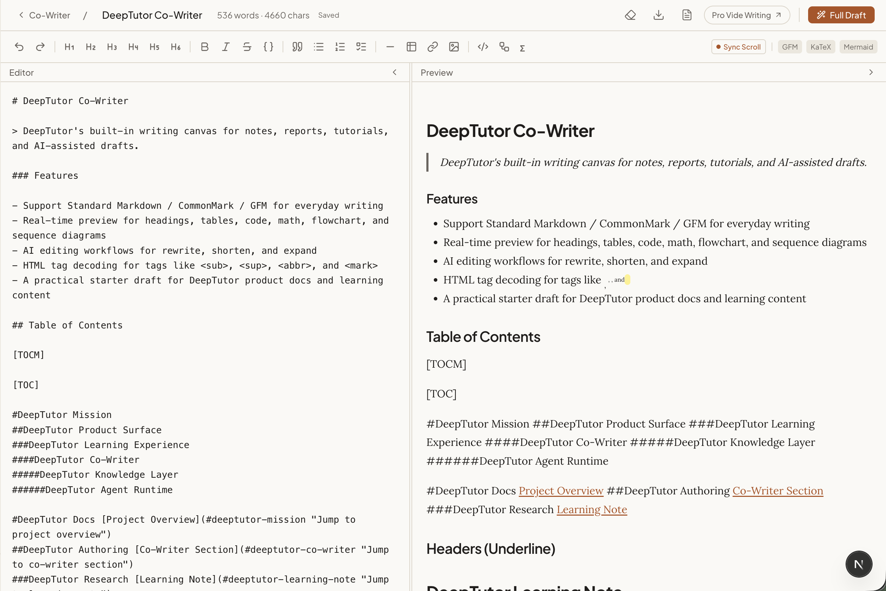
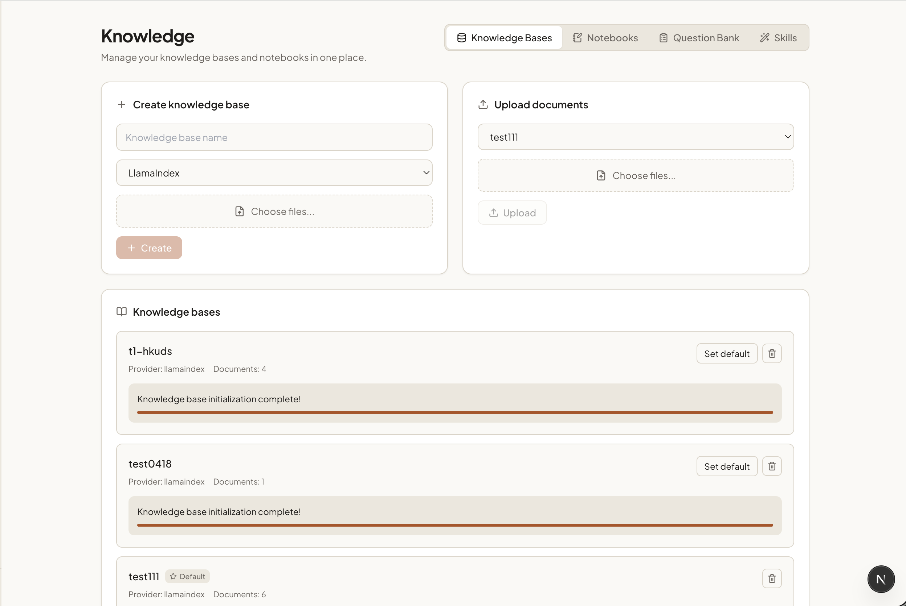

<div align="center">


# DeepTutor: Agent-Native Personalized Tutoring

<a href="https://trendshift.io/repositories/17099" target="_blank"></a>

[](https://www.python.org/downloads/)
[](https://nextjs.org/)
[](LICENSE)
[](https://github.com/HKUDS/DeepTutor/releases)
[](#)

[](https://discord.gg/eRsjPgMU4t)
[](./Communication.md)
[](https://github.com/HKUDS/DeepTutor/issues/78)

[For Toddlers](#-for-toddlers--direct-learning-experiences) · [For Parents](#-for-parents--caregivers----setup-monitoring-and-content) · [For Educators](#-for-educators----curriculum-design--research) · [Get Started](#-get-started) · [Explore](#-explore-deeptutor) · [Tools](#-tools--the-reasoning-layer) · [TutorBot](#-tutorbot--persistent-autonomous-ai-tutors) · [CLI](#%EF%B8%8F-deeptutor-cli--agent-native-interface) · [Architecture](#%EF%B8%8F-technical-architecture) · [Observability](#-observability--llm-logging) · [Community](#-community--ecosystem)

[🇨🇳 中文](assets/README/README_CN.md) · [🇯🇵 日本語](assets/README/README_JA.md) · [🇪🇸 Español](assets/README/README_ES.md) · [🇫🇷 Français](assets/README/README_FR.md) · [🇸🇦 العربية](assets/README/README_AR.md) · [🇷🇺 Русский](assets/README/README_RU.md) · [🇮🇳 हिन्दी](assets/README/README_HI.md) · [🇵🇹 Português](assets/README/README_PT.md)

</div>

---

### 📰 News

> **[2026.4.4]** Long time no see! ✨ DeepTutor v1.0.0 is finally here — an agent-native evolution featuring a ground-up architecture rewrite, TutorBot, and flexible mode switching under the Apache-2.0 license. A new chapter begins, and our story continues!

> **[2026.2.6]** 🚀 We've reached 10k stars in just 39 days! A huge thank you to our incredible community for the support!

> **[2026.1.1]** Happy New Year! Join our [Discord](https://discord.gg/eRsjPgMU4t), [WeChat](https://github.com/HKUDS/DeepTutor/issues/78), or [Discussions](https://github.com/HKUDS/DeepTutor/discussions) — let's shape the future of DeepTutor together!

> **[2025.12.29]** DeepTutor is officially released!

### 📦 Releases

> **[2026.4.14]** Comprehensive LLM observability: `QUERY |` log lines with agent/stage context for every LLM call (including Ollama and local servers), `LLM |` metrics lines with token counts, latency, and cost. Fix `response_format` errors for Claude and OpenAI reasoning models (`o3`, `o4-mini`, etc.) used via OpenAI-compatible proxy — these models now correctly skip `json_object` and rely on prompt-based JSON extraction.

> **[2026.4.11]** [v1.0.2](https://github.com/HKUDS/DeepTutor/releases/tag/v1.0.2) — Search consolidation simplification with SearXNG fallback, provider switch fix, explicit runtime config in test runner, and frontend resource leak fixes.

> **[2026.4.10]** [v1.0.1](https://github.com/HKUDS/DeepTutor/releases/tag/v1.0.1) — New Visualize capability with Chart.js/SVG rendering pipeline, quiz duplicate prevention with generation history, o4-mini model support, and server logging improvements.

> **[2026.4.10]** [v1.0.0-beta.4](https://github.com/HKUDS/DeepTutor/releases/tag/v1.0.0-beta.4) — Embedding progress tracking with HTTP 429 rate limit retry, cross-platform start tour dependency management, and case-insensitive MIME validation fix.

> **[2026.4.8]** [v1.0.0-beta.3](https://github.com/HKUDS/DeepTutor/releases/tag/v1.0.0-beta.3) — Remove litellm dependency with native OpenAI/Anthropic SDK providers, Windows Math Animator compatibility, robust JSON parsing for LLM outputs, Guided Learning KaTeX & navigation fixes, and full i18n coverage for Chinese.

> **[2026.4.7]** [v1.0.0-beta.2](https://github.com/HKUDS/DeepTutor/releases/tag/v1.0.0-beta.2) — Runtime cache invalidation for hot settings reload, MinerU nested output support, mimic WebSocket fix, Python 3.11+ minimum, and CI improvements.

> **[2026.4.4]** [v1.0.0-beta.1](https://github.com/HKUDS/DeepTutor/releases/tag/v1.0.0-beta.1) — Agent-native architecture rewrite (~200k lines) with two-layer plugin model (Tools + Capabilities), CLI & SDK entry points, TutorBot multi-channel bot agent, Co-Writer, Guided Learning, and persistent memory.

<details>
<summary><b>Past releases</b></summary>

> **[2026.1.23]** [v0.6.0](https://github.com/HKUDS/DeepTutor/releases/tag/v0.6.0) — Session persistence, incremental document upload, flexible RAG pipeline import, and full Chinese localization.

> **[2026.1.18]** [v0.5.2](https://github.com/HKUDS/DeepTutor/releases/tag/v0.5.2) — Docling support for RAG-Anything, logging system optimization, and bug fixes.

> **[2026.1.15]** [v0.5.0](https://github.com/HKUDS/DeepTutor/releases/tag/v0.5.0) — Unified service configuration, RAG pipeline selection per knowledge base, question generation overhaul, and sidebar customization.

> **[2026.1.9]** [v0.4.0](https://github.com/HKUDS/DeepTutor/releases/tag/v0.4.0) — Multi-provider LLM & embedding support, new home page, RAG module decoupling, and environment variable refactor.

> **[2026.1.5]** [v0.3.0](https://github.com/HKUDS/DeepTutor/releases/tag/v0.3.0) — Unified PromptManager architecture, GitHub Actions CI/CD, and pre-built Docker images on GHCR.

> **[2026.1.2]** [v0.2.0](https://github.com/HKUDS/DeepTutor/releases/tag/v0.2.0) — Docker deployment, Next.js 16 & React 19 upgrade, WebSocket security hardening, and critical vulnerability fixes.

</details>

---

## ✨ Key Features

DeepTutor is designed for **early childhood education** — toddlers ages 1–5 learn best through visuals, stories, play, and repetition. Every feature below maps to how young children actually learn.

### 🧒 For Toddlers — Direct Learning Experiences

- **Animated Learning** — Letters forming, numbers counting, shapes dancing — the Math Animator turns abstract concepts into short videos toddlers can watch and rewatch. A five-stage pipeline (concept → design → Manim code → render → narration) produces `.mp4` or `.png` sequences. Ideal for ABCs, 123s, colors, and basic phonics.
- **Step-by-Step Visual Journeys** — Guided Learning breaks any topic (colors, animals, the alphabet) into 3–5 progressive knowledge points, each as a rich interactive HTML page with pictures, diagrams, and examples sized for short attention spans. Toddlers can pause and resume exactly where they left off.
- **Storytime & Rhymes** — Chat mode generates age-appropriate stories, nursery rhymes, and bedtime tales on demand. Just ask: *"Tell a story about a lost duckling"* or *"Make a counting rhyme about frogs"*.
- **Drawing Recognition** — Vision Solver reads what a toddler draws or photographs. Upload a picture and ask *"What shape did I draw?"* — DeepTutor identifies it, names it, and extends the learning moment.
- **Simple Matching Games** — Quiz Generation creates visual matching activities: shape → name, animal → sound, color → object. Built-in duplicate prevention keeps games fresh across sessions.
- **Picture-Book Learning** — Visualize generates color wheels, animal family charts, shape grids, and counting boards inline in conversation — no separate app needed.
- **Bilingual Vocabulary** — Responses available in 9 languages (English, Chinese, Japanese, Spanish, French, Arabic, Russian, Hindi, Portuguese). Ideal for multilingual families building parallel vocabulary from day one.

### 👨‍👩‍👧 For Parents & Caregivers — Setup, Monitoring, and Content

- **Personal TutorBot per Child** — Set up a dedicated TutorBot with a warm, patient persona for each child. The bot remembers what the child has covered, adapts to their pace, and proactively sends daily activity reminders via Telegram, WhatsApp, or any of 11 channels. Powered by [nanobot](https://github.com/HKUDS/nanobot).
- **Daily Routine Scheduling** — The built-in Heartbeat and Cron services let you schedule morning circle time, afternoon practice, and bedtime story prompts — the tutor shows up even when you don't.
- **Upload Your Materials** — Add any PDF storybook, activity sheet, or curriculum guide to the Knowledge Hub. DeepTutor indexes it (parse → chunk → embed) and draws on it in every conversation, so answers always match the materials you trust.
- **Progress Memory** — A two-layer memory system (PROFILE.md for the child's learning profile + SUMMARY.md for a searchable history) tracks every topic covered, concept mastered, and gap to revisit. Shared across all features.
- **Content Creation** — Co-Writer helps parents draft personalized bedtime stories, activity worksheets, or learning plans in Markdown with AI assist — then save them straight to notebooks for reuse.
- **Sandboxed & Safe** — Code execution runs in a strict sandbox (no filesystem, no network, no subprocess access). Local LLM support via Ollama means the whole system can run offline with no data leaving the house.

### 🏫 For Educators — Curriculum Design & Research

- **Curriculum Authoring** — Guided Learning sessions are fully configurable: upload your own materials, define the knowledge points, set the narrative. Each point generates a standalone HTML page suitable for classroom display.
- **Research on Child Development** — Deep Research decomposes any topic (e.g., *"phonics methods for 3-year-olds"*) into subtopics, dispatches parallel agents across RAG, web, and academic papers, and produces a cited report in minutes.
- **Assessment Generation** — Quiz Generation produces structured QA pairs (difficulty level, question type, correct answer) grounded in uploaded curriculum materials. Export as structured JSON for integration into other tools.
- **Multi-Classroom TutorBots** — Deploy one TutorBot per classroom or learning group, each with its own persona, memory, and channel. The Channel Manager handles allow-from validation so only authorised users can interact.
- **Activity Notebooks** — Organize generated stories, lesson plans, and research notes into color-coded notebooks. Export to Markdown for printing or sharing.

### ⚙️ Platform Capabilities

- **8 Learning Modes** — Chat · Guided Learning · Math Animator · Visualize · Vision Solver · Quiz Generation · Deep Research · Co-Writer — all sharing one conversation thread.
- **7 Composable Tools** — RAG retrieval · web search · sandboxed code execution · deep reasoning · brainstorming · paper search · vision parsing. Enable exactly what you need per turn.
- **30+ LLM Providers** — OpenAI, Anthropic, DeepSeek, Gemini, Ollama (local/offline), Groq, Azure, and more. Per-model capability flags handle vision, JSON mode, prompt caching, and reasoning models automatically.
- **11 TutorBot Channels** — Telegram · WhatsApp · Discord · Slack · Feishu · WeChat Work · DingTalk · Matrix · Email · QQ · MoChat.
- **Real-Time Streaming** — WebSocket-based `StreamEvent` frames deliver thinking, tool calls, progress, and content live — no polling.
- **Full Observability** — Every LLM call logged with provider, model, tokens, cost, latency, and the exact agent/stage/capability that triggered it.
- **Agent-Native CLI** — Every capability accessible from the terminal. Structured JSON output for pipelines and automation.

---

## 🚀 Get Started

### Option A — Setup Tour (Recommended)

A **single interactive script** that walks you through everything: dependency installation, environment configuration, live connection testing, and launch. No manual `.env` editing needed.

```bash
git clone https://github.com/HKUDS/DeepTutor.git
cd DeepTutor

# Create a Python environment
conda create -n deeptutor python=3.11 && conda activate deeptutor
# Or: python -m venv .venv && source .venv/bin/activate

# Launch the guided tour
python scripts/start_tour.py
```

The tour auto-detects your platform (conda/venv/system Python, brew/apt/winget Node.js) and asks how you'd like to use DeepTutor. If a previous run was interrupted, it offers to resume where it left off.

**Web mode** (recommended) — 4 steps, browser-based configuration:

| Step | What Happens |
|:---|:---|
| 1. Install profile | Choose `web-basic` (FastAPI + Next.js) or `web-rag` (+ LlamaIndex RAG) |
| 2. Ports | Set backend and frontend ports (defaults: `8001` / `3782`) |
| 3. Dependencies | Installs Python packages via pip, npm packages, and optionally Manim for Math Animator. Installs Node.js automatically if missing (brew/apt/winget). |
| 4. Configure in browser | Spins up a temporary server, opens `localhost:<port>/settings?tour=true`. Configure LLM, Embedding, and Search providers with live connection testing. Click **Complete & Launch** — the tour shuts down the temp server and relaunches DeepTutor with your config. |

**CLI mode** — 6 steps, fully terminal-based:

| Step | What Happens |
|:---|:---|
| 1. Install profile | Choose `cli-core` (minimal, ~80 MB) or `cli-rag` (+ LlamaIndex RAG) |
| 2. Ports | Set the backend port |
| 3. Dependencies | Installs Python packages |
| 4. Configure providers | Interactive prompts for LLM (binding, base URL, API key, model ID), Embedding, and optionally Search |
| 5. Verify connections | Live streaming test against each configured endpoint — both LLM and Embedding must pass |
| 6. Review & apply | Displays a summary, then writes `model_catalog.json` and `.env` |

Either way, you end up with a running DeepTutor at [http://localhost:3782](http://localhost:3782).

> To restart the server after configuration changes, run `python deeptutor/api/run_server.py` (backend) and `cd web && npm run dev` (frontend) in separate terminals.

### Option B — Manual Local Install

If you prefer full control, install and configure everything yourself.

**1. Install dependencies**

```bash
git clone https://github.com/HKUDS/DeepTutor.git
cd DeepTutor

conda create -n deeptutor python=3.11 && conda activate deeptutor
pip install -e ".[server]"

# Frontend
cd web && npm install && cd ..
```

**2. Configure environment**

```bash
cp .env.example .env
```

Edit `.env` and fill in at least the required fields:

```dotenv
# LLM (Required)
LLM_BINDING=openai
LLM_MODEL=gpt-4o-mini
LLM_API_KEY=sk-xxx
LLM_HOST=https://api.openai.com/v1

# Embedding (Required for Knowledge Base)
EMBEDDING_BINDING=openai
EMBEDDING_MODEL=text-embedding-3-large
EMBEDDING_API_KEY=sk-xxx
EMBEDDING_HOST=https://api.openai.com/v1
EMBEDDING_DIMENSION=3072
```

<details>
<summary><b>Supported LLM Providers</b></summary>

| Provider | Binding | Default Base URL |
|:--|:--|:--|
| AiHubMix | `aihubmix` | `https://aihubmix.com/v1` |
| Anthropic | `anthropic` | `https://api.anthropic.com/v1` |
| Azure OpenAI | `azure_openai` | — |
| BytePlus | `byteplus` | `https://ark.ap-southeast.bytepluses.com/api/v3` |
| BytePlus Coding Plan | `byteplus_coding_plan` | `https://ark.ap-southeast.bytepluses.com/api/coding/v3` |
| Custom (OpenAI-compat) | `custom` | — |
| DashScope (Qwen) | `dashscope` | `https://dashscope.aliyuncs.com/compatible-mode/v1` |
| DeepSeek | `deepseek` | `https://api.deepseek.com` |
| Gemini | `gemini` | `https://generativelanguage.googleapis.com/v1beta/openai/` |
| GitHub Copilot | `github_copilot` | `https://api.githubcopilot.com` |
| Groq | `groq` | `https://api.groq.com/openai/v1` |
| MiniMax | `minimax` | `https://api.minimax.io/v1` |
| Mistral | `mistral` | `https://api.mistral.ai/v1` |
| Moonshot (Kimi) | `moonshot` | `https://api.moonshot.ai/v1` |
| Ollama | `ollama` | `http://localhost:11434/v1` |
| OpenAI | `openai` | `https://api.openai.com/v1` |
| OpenAI Codex | `openai_codex` | `https://chatgpt.com/backend-api` |
| OpenRouter | `openrouter` | `https://openrouter.ai/api/v1` |
| OpenVINO Model Server | `ovms` | `http://localhost:8000/v3` |
| Qianfan (Ernie) | `qianfan` | `https://qianfan.baidubce.com/v2` |
| SiliconFlow | `siliconflow` | `https://api.siliconflow.cn/v1` |
| Step Fun | `stepfun` | `https://api.stepfun.com/v1` |
| vLLM | `vllm` | `http://localhost:8000/v1` |
| VolcEngine | `volcengine` | `https://ark.cn-beijing.volces.com/api/v3` |
| VolcEngine Coding Plan | `volcengine_coding_plan` | `https://ark.cn-beijing.volces.com/api/coding/v3` |
| Xiaomi MIMO | `xiaomi_mimo` | `https://api.xiaomimimo.com/v1` |
| Zhipu AI (GLM) | `zhipu` | `https://open.bigmodel.cn/api/paas/v4` |

</details>

<details>
<summary><b>Supported Embedding Providers</b></summary>

Embedding uses the same provider list as LLM. Common choices:

| Provider | Binding | Model Example |
|:--|:--|:--|
| OpenAI | `openai` | `text-embedding-3-large` |
| DashScope | `dashscope` | `text-embedding-v3` |
| Ollama | `ollama` | `nomic-embed-text` |
| SiliconFlow | `siliconflow` | `BAAI/bge-m3` |
| vLLM | `vllm` | Any embedding model |
| Any OpenAI-compatible | `custom` | — |

</details>

<details>
<summary><b>Supported Web Search Providers</b></summary>

| Provider | Env Key | Notes |
|:--|:--|:--|
| Brave | `BRAVE_API_KEY` | Recommended, free tier available |
| Tavily | `TAVILY_API_KEY` | |
| Jina | `JINA_API_KEY` | |
| SearXNG | — | Self-hosted, no API key needed |
| DuckDuckGo | — | No API key needed |
| Perplexity | `PERPLEXITY_API_KEY` | Requires API key |

</details>

**3. Start services**

```bash
# Backend (FastAPI)
python -m deeptutor.api.run_server

# Frontend (Next.js) — in a separate terminal
cd web && npm run dev -- -p 3782
```

| Service | Default Port |
|:---:|:---:|
| Backend | `8001` |
| Frontend | `3782` |

Open [http://localhost:3782](http://localhost:3782) and you're ready to go.

### Option C — Docker Deployment

Docker wraps the backend and frontend into a single container — no local Python or Node.js required. Two options depending on your preference:

**1. Configure environment variables** (required for both options)

```bash
git clone https://github.com/HKUDS/DeepTutor.git
cd DeepTutor
cp .env.example .env
```

Edit `.env` and fill in at least the required fields (same as [Option B](#option-b--manual-local-install) above).

**2a. Pull official image (recommended)**

Official images are published to [GitHub Container Registry](https://github.com/HKUDS/DeepTutor/pkgs/container/deeptutor) on every release, built for `linux/amd64` and `linux/arm64`.

```bash
docker compose -f docker-compose.ghcr.yml up -d
```

To pin a specific version, edit the image tag in `docker-compose.ghcr.yml`:

```yaml
image: ghcr.io/hkuds/deeptutor:1.0.0  # or :latest
```

**2b. Build from source**

```bash
docker compose up -d
```

This builds the image locally from `Dockerfile` and starts the container.

**3. Verify & manage**

Open [http://localhost:3782](http://localhost:3782) once the container is healthy.

```bash
docker compose logs -f   # tail logs
docker compose down       # stop and remove container
```

<details>
<summary><b>Cloud / remote server deployment</b></summary>

When deploying to a remote server, the browser needs to know the public URL of the backend API. Add one more variable to your `.env`:

```dotenv
# Set to the public URL where the backend is reachable
NEXT_PUBLIC_API_BASE_EXTERNAL=https://your-server.com:8001
```

The frontend startup script applies this value at runtime — no rebuild needed.

</details>

<details>
<summary><b>Development mode (hot-reload)</b></summary>

Layer the dev override to mount source code and enable hot-reload for both services:

```bash
docker compose -f docker-compose.yml -f docker-compose.dev.yml up
```

Changes to `deeptutor/`, `deeptutor_cli/`, `scripts/`, and `web/` are reflected immediately.

</details>

<details>
<summary><b>Custom ports</b></summary>

Override the default ports in `.env`:

```dotenv
BACKEND_PORT=9001
FRONTEND_PORT=4000
```

Then restart:

```bash
docker compose up -d     # or docker compose -f docker-compose.ghcr.yml up -d
```

</details>

<details>
<summary><b>Data persistence</b></summary>

User data and knowledge bases are persisted via Docker volumes mapped to local directories:

| Container path | Host path | Content |
|:---|:---|:---|
| `/app/data/user` | `./data/user` | Settings, memory, workspace, sessions, logs |
| `/app/data/knowledge_bases` | `./data/knowledge_bases` | Uploaded documents & vector indices |

These directories survive `docker compose down` and are reused on the next `docker compose up`.

</details>

<details>
<summary><b>Environment variables reference</b></summary>

| Variable | Required | Description |
|:---|:---:|:---|
| `LLM_BINDING` | **Yes** | LLM provider (`openai`, `anthropic`, etc.) |
| `LLM_MODEL` | **Yes** | Model name (e.g. `gpt-4o`) |
| `LLM_API_KEY` | **Yes** | Your LLM API key |
| `LLM_HOST` | **Yes** | API endpoint URL |
| `EMBEDDING_BINDING` | **Yes** | Embedding provider |
| `EMBEDDING_MODEL` | **Yes** | Embedding model name |
| `EMBEDDING_API_KEY` | **Yes** | Embedding API key |
| `EMBEDDING_HOST` | **Yes** | Embedding endpoint |
| `EMBEDDING_DIMENSION` | **Yes** | Vector dimension |
| `SEARCH_PROVIDER` | No | Search provider (`tavily`, `jina`, `brave`, `duckduckgo`, `perplexity`, `searxng`) |
| `SEARCH_API_KEY` | No | Search API key |
| `BACKEND_PORT` | No | Backend port (default `8001`) |
| `FRONTEND_PORT` | No | Frontend port (default `3782`) |
| `NEXT_PUBLIC_API_BASE_EXTERNAL` | No | Public backend URL for cloud deployment |
| `DISABLE_SSL_VERIFY` | No | Disable SSL verification (default `false`) |

</details>

### Option D — CLI Only

If you just want the CLI without the web frontend:

```bash
pip install -e ".[cli]"
deeptutor chat                                   # Interactive REPL
deeptutor run chat "Explain Fourier transform"   # One-shot capability
deeptutor run deep_solve "Solve x^2 = 4"         # Multi-agent problem solving
deeptutor kb create my-kb --doc textbook.pdf     # Build a knowledge base
```

> See [DeepTutor CLI](#%EF%B8%8F-deeptutor-cli--agent-native-interface) for the full feature guide and command reference.

---

## 📖 Explore DeepTutor

<div align="center">

</div>

### 💬 Chat — Unified Intelligent Workspace

<div align="center">

</div>

Seven distinct modes coexist in a single workspace, bound by a **unified context management system**. Conversation history, knowledge bases, and references persist across modes — switch between them freely within the same topic, whenever the moment calls for it.

| Mode | What It Does |
|:---|:---|
| **Chat** | Fluid, tool-augmented conversation. Choose from RAG retrieval, web search, code execution, deep reasoning, brainstorming, and paper search — mix and match as needed. Multi-turn with token-aware history truncation. |
| **Deep Solve** | Multi-agent problem solving: plan → decompose → solve → verify — with precise source citations at every step. |
| **Quiz Generation** | Generate assessments grounded in your knowledge base using a two-stage pipeline: idea generation (batched templates) → question generation (QA pairs). Built-in duplicate prevention via generation history. |
| **Deep Research** | Decompose a topic into subtopics, dispatch parallel research agents across RAG, web, and academic papers, and produce a fully cited report with `CitationManager`. Supports pre-confirmed outlines to skip decomposition. |
| **Math Animator** | Turn mathematical concepts into visual animations powered by Manim. Five-stage pipeline: concept analysis → scene design → code generation → render + retry → summary. Outputs MP4 video or PNG image sequences. |
| **Visualize** | Generate charts and diagrams from data or context. Supports bar, line, pie, scatter, and custom SVG via Chart.js — rendered live inside the conversation. |
| **Guided Learning** | Design a personalized multi-step learning journey from your materials. Each knowledge point gets an interactive HTML page with explanations, diagrams, and contextual Q&A. Sessions persist across pause/resume. |
| **Vision Solver** | Analyze math problem images and generate GeoGebra visualizations. Pipeline: image upload → coordinate extraction → GeoGebra command generation → validation → interactive output. |

Tools are **decoupled from workflows** — in every mode, you decide which tools to enable, how many to use, or whether to use any at all. The workflow orchestrates the reasoning; the tools are yours to compose.

> Start with a quick chat question, escalate to Deep Solve when it gets hard, generate quiz questions to test yourself, then launch a Deep Research to go deeper — all in one continuous thread.

### ✍️ Co-Writer — AI Inside Your Editor

<div align="center">

</div>

Co-Writer brings the intelligence of Chat directly into a writing surface. It is a full-featured Markdown editor where AI is a first-class collaborator — not a sidebar, not an afterthought.

Select any text and choose **Rewrite**, **Expand**, or **Shorten** — optionally drawing context from your knowledge base or the web. The editing flow is non-destructive with full undo/redo, and every piece you write can be saved straight to your notebooks, feeding back into your learning ecosystem.

### 🎓 Guided Learning — Visual, Step-by-Step Mastery

<div align="center">

</div>

Guided Learning turns your personal materials into structured, multi-step learning journeys. Provide a topic, optionally link notebook records, and DeepTutor will:

1. **Design a learning plan** — Identify 3–5 progressive knowledge points from your materials.
2. **Generate interactive pages** — Each point becomes a rich visual HTML page with explanations, diagrams, and examples.
3. **Enable contextual Q&A** — Chat alongside each step for deeper exploration.
4. **Summarize your progress** — Upon completion, receive a learning summary of everything you've covered.

Sessions are persistent — pause, resume, or revisit any step at any time.

### 📊 Math Animator & Visualize — See the Math

**Math Animator** transforms a mathematical concept into a rendered animation through a five-stage pipeline:

```
User prompt
  → Concept Analysis   (learning goal, visual targets, narrative steps)
  → Scene Design       (scene outline, animation notes, code constraints)
  → Code Generation    (Manim Python code, duration-aware)
  → Render + Retry     (Manim subprocess, up to 4 auto-repair attempts)
  → Summary            (plain-language explanation of the animation)
```

Both **video** (`.mp4`) and **image** (`.png` per scene block) output modes are supported. Requires `pip install 'deeptutor[math-animator]'` (Manim dependency).

**Visualize** generates publication-quality charts and custom SVG diagrams from conversational context or raw data, using Chart.js. All output is rendered inline — no separate tool needed.

### 📚 Knowledge Management — Your Learning Infrastructure

<div align="center">

</div>

Knowledge is where you build and manage the document collections that power everything else in DeepTutor.

- **Knowledge Bases** — Upload PDF, TXT, or Markdown files to create searchable, RAG-ready collections. Add documents incrementally as your library grows. Progress is tracked in real time with rate-limit-aware retry.
- **Notebooks** — Organize learning records across sessions. Save insights from Chat, Guided Learning, Co-Writer, or Deep Research into categorized, color-coded notebooks.

Your knowledge base is not passive storage — it actively participates in every conversation, every research session, and every learning path you create.

#### RAG Pipeline

Documents go through a five-stage processing pipeline:

| Stage | What Happens |
|:---|:---|
| **Parse** | Format-specific parser extracts clean text (PDF, Markdown, TXT, academic papers via MinerU) |
| **Chunk** | Text split into semantic units with configurable overlap. Numbered-item chunker preserves list structure. |
| **Embed** | Each chunk converted to a vector via your embedding model (OpenAI, DashScope, Ollama, SiliconFlow, etc.) |
| **Index** | Vectors stored in a vector database for fast nearest-neighbor retrieval |
| **Retrieve** | Hybrid search (dense vector + keyword) with optional reranking returns top-K results with source metadata |

Supported document formats: `.pdf`, `.md`, `.txt`. Academic papers parsed via MinerU for structured extraction including equations, tables, and figures.

### 🧠 Memory — DeepTutor Learns As You Learn

<div align="center">

</div>

DeepTutor maintains a persistent, evolving understanding of you through two complementary dimensions:

- **Summary** — A running digest of your learning progress: what you've studied, which topics you've explored, and how your understanding has developed.
- **Profile** — Your learner identity: preferences, knowledge level, goals, and communication style — automatically refined through every interaction.

Memory is shared across all features and all your TutorBots. The more you use DeepTutor, the more personalized and effective it becomes.

---

## 🔧 Tools — The Reasoning Layer

Every capability in DeepTutor is built from a composable set of tools. You control which tools are active per conversation turn. Each tool can be used standalone or in combination.

| Tool | ID | What It Does |
|:---|:---|:---|
| **RAG Retrieval** | `rag` | Retrieves semantically relevant passages from your knowledge bases using hybrid vector + keyword search. Results are ranked and fed to the LLM for grounded answers with source citations. |
| **Web Search** | `web_search` | Queries your configured search provider (Brave, Tavily, DuckDuckGo, Perplexity, SearXNG, Jina) and returns summarized, cited results with answer consolidation across providers. |
| **Code Execution** | `code_executor` | Runs Python code in a sandboxed subprocess. Allowed: math, numpy, pandas, matplotlib, scipy, sympy, json, datetime, re, collections. Blocked: os, sys, subprocess, socket, open, exec, eval, importlib. Artifacts (code.py, output.log) persisted per task run. |
| **Deep Reasoning** | `reason` | Dedicates a focused LLM call to structured step-by-step reasoning — useful for proofs, multi-step derivations, or any problem requiring deliberate logical chains without external tool calls. |
| **Brainstorming** | `brainstorm` | Generates 5–8 distinct directions, angles, or approaches on a topic before converging. Each direction includes a justification. Useful for open-ended exploration and creative tasks. |
| **Paper Search** | `paper_search` | Queries arXiv and academic paper indices for relevant research. Returns abstracts, authors, and citation metadata alongside retrieved passages. |
| **Vision Tools** | `vision` | Block parser for GeoGebra extraction from images, coordinate transform (image → GeoGebra coordinate space), GeoGebra command validator, and image preprocessing utilities. Used internally by Vision Solver. |

Tools are **first-class plugins** — the same `BaseTool` interface that powers built-in tools can be used to add custom tools without modifying core code.

---

## 🦞 TutorBot — Persistent, Autonomous AI Tutors

<div align="center">

</div>

TutorBot is not a chatbot — it is a **persistent, multi-instance agent** built on [nanobot](https://github.com/HKUDS/nanobot). Each TutorBot runs its own agent loop with independent workspace, memory, and personality. Create a Socratic math tutor, a patient writing coach, and a rigorous research advisor — all running simultaneously, each evolving with you.

<div align="center">

</div>

- **Soul Templates** — Define your tutor's personality, tone, and teaching philosophy through editable Soul files. Choose from built-in archetypes (Socratic, encouraging, rigorous) or craft your own — the soul shapes every response.
- **Independent Workspace** — Each bot has its own directory with separate memory (PROFILE.md + SUMMARY.md), sessions, skills, and configuration — fully isolated yet able to access DeepTutor's shared knowledge layer.
- **Proactive Heartbeat** — Bots don't just respond — they initiate. The built-in `HeartbeatService` enables recurring study check-ins, review reminders, and scheduled tasks. A `CronService` handles persistent background scheduling. Your tutor shows up even when you don't.
- **Full Tool Access** — Every bot reaches into DeepTutor's complete toolkit: RAG retrieval, code execution, web search, academic paper search, deep reasoning, and brainstorming.
- **Skill Learning** — Teach your bot new abilities by adding skill files to its workspace. As your needs evolve, so does your tutor's capability.
- **11 Communication Channels** — Connect your tutor to any platform via the `ChannelManager`:

  | Channel | Notes |
  |:---|:---|
  | Telegram | Full message routing with allow-from validation |
  | WhatsApp | Direct messaging |
  | Discord | Server and DM support |
  | Slack | Workspace messaging |
  | Feishu (Lark) | Comprehensive enterprise integration |
  | WeChat Work (WeCom) | Enterprise WeChat |
  | DingTalk | Alibaba enterprise platform |
  | Matrix | Decentralized open protocol |
  | MoChat | Chinese enterprise chat |
  | Email | SMTP/IMAP integration |
  | QQ | Tencent QQ messaging |

- **Team & Sub-Agents** — Spawn background sub-agents or orchestrate multi-agent teams with shared state (`Board`), async message passing (`Mailbox`), and max 40 iterations per turn (configurable up to 65,536 token context).

```bash
deeptutor bot create math-tutor --persona "Socratic math teacher who uses probing questions"
deeptutor bot create writing-coach --persona "Patient, detail-oriented writing mentor"
deeptutor bot list                  # See all your active tutors
```

---

## ⌨️ DeepTutor CLI — Agent-Native Interface

<div align="center">

</div>

DeepTutor is fully CLI-native. Every capability, knowledge base, session, memory, and TutorBot is one command away — no browser required. The CLI serves both humans (with rich terminal rendering) and AI agents (with structured JSON output).

Hand the [`SKILL.md`](SKILL.md) at the project root to any tool-using agent ([nanobot](https://github.com/HKUDS/nanobot), or any LLM with tool access), and it can configure and operate DeepTutor autonomously.

**One-shot execution** — Run any capability directly from the terminal:

```bash
deeptutor run chat "Explain the Fourier transform" -t rag --kb textbook
deeptutor run deep_solve "Prove that √2 is irrational" -t reason
deeptutor run deep_question "Linear algebra" --config num_questions=5
deeptutor run deep_research "Attention mechanisms in transformers"
deeptutor run math_animator "Animate the chain rule"
deeptutor run visualize "Plot a sine wave from 0 to 2π"
```

**Interactive REPL** — A persistent chat session with live mode switching:

```bash
deeptutor chat --capability deep_solve --kb my-kb
# Inside the REPL: /cap, /tool, /kb, /history, /notebook, /config to switch on the fly
```

**Knowledge base lifecycle** — Build, query, and manage RAG-ready collections entirely from the terminal:

```bash
deeptutor kb create my-kb --doc textbook.pdf       # Create from document
deeptutor kb add my-kb --docs-dir ./papers/         # Add a folder of papers
deeptutor kb search my-kb "gradient descent"        # Search directly
deeptutor kb set-default my-kb                      # Set as default for all commands
```

**Dual output mode** — Rich rendering for humans, structured JSON for pipelines:

```bash
deeptutor run chat "Summarize chapter 3" -f rich    # Colored, formatted output
deeptutor run chat "Summarize chapter 3" -f json    # Line-delimited JSON events
```

**Session continuity** — Resume any conversation right where you left off:

```bash
deeptutor session list                              # List all sessions
deeptutor session open <id>                         # Resume in REPL
```

<details>
<summary><b>Full CLI command reference</b></summary>

**Top-level**

| Command | Description |
|:---|:---|
| `deeptutor run <capability> <message>` | Run any capability in a single turn (`chat`, `deep_solve`, `deep_question`, `deep_research`, `math_animator`, `visualize`) |
| `deeptutor chat` | Interactive REPL with optional `--capability`, `--tool`, `--kb`, `--language` |
| `deeptutor serve` | Start the DeepTutor API server |

**`deeptutor bot`**

| Command | Description |
|:---|:---|
| `deeptutor bot list` | List all TutorBot instances |
| `deeptutor bot create <id>` | Create and start a new bot (`--name`, `--persona`, `--model`) |
| `deeptutor bot start <id>` | Start a bot |
| `deeptutor bot stop <id>` | Stop a bot |

**`deeptutor kb`**

| Command | Description |
|:---|:---|
| `deeptutor kb list` | List all knowledge bases |
| `deeptutor kb info <name>` | Show knowledge base details |
| `deeptutor kb create <name>` | Create from documents (`--doc`, `--docs-dir`) |
| `deeptutor kb add <name>` | Add documents incrementally |
| `deeptutor kb search <name> <query>` | Search a knowledge base |
| `deeptutor kb set-default <name>` | Set as default KB |
| `deeptutor kb delete <name>` | Delete a knowledge base (`--force`) |

**`deeptutor memory`**

| Command | Description |
|:---|:---|
| `deeptutor memory show [file]` | View memory (`summary`, `profile`, or `all`) |
| `deeptutor memory clear [file]` | Clear memory (`--force`) |

**`deeptutor session`**

| Command | Description |
|:---|:---|
| `deeptutor session list` | List sessions (`--limit`) |
| `deeptutor session show <id>` | View session messages |
| `deeptutor session open <id>` | Resume session in REPL |
| `deeptutor session rename <id>` | Rename a session (`--title`) |
| `deeptutor session delete <id>` | Delete a session |

**`deeptutor notebook`**

| Command | Description |
|:---|:---|
| `deeptutor notebook list` | List notebooks |
| `deeptutor notebook create <name>` | Create a notebook (`--description`) |
| `deeptutor notebook show <id>` | View notebook records |
| `deeptutor notebook add-md <id> <path>` | Import markdown as record |
| `deeptutor notebook replace-md <id> <rec> <path>` | Replace a markdown record |
| `deeptutor notebook remove-record <id> <rec>` | Remove a record |

**`deeptutor config` / `plugin` / `provider`**

| Command | Description |
|:---|:---|
| `deeptutor config show` | Print current configuration summary |
| `deeptutor plugin list` | List registered tools and capabilities |
| `deeptutor plugin info <name>` | Show tool or capability details |
| `deeptutor provider login <provider>` | Provider auth (`openai-codex` OAuth login; `github-copilot` validates an existing Copilot auth session) |

</details>

---

## 🏗️ Technical Architecture

DeepTutor is built on a **two-layer plugin model**: Tools (single-function) and Capabilities (multi-step pipelines). Every feature you see in the UI is a Capability composed of Tools.

```
┌─────────────────────────────────────────────────────────────┐
│  Clients: Web (Next.js 16) · CLI (Typer) · SDK              │
└───────────────────────┬─────────────────────────────────────┘
                        │  WebSocket (ws://host:8001/api/v1/ws)
                        │  REST  (http://host:8001/api/v1/*)
┌───────────────────────▼─────────────────────────────────────┐
│  FastAPI + Uvicorn (deeptutor/api/)                          │
│  Routers: chat · knowledge · solve · research · guide ···    │
└───────────────────────┬─────────────────────────────────────┘
                        │
┌───────────────────────▼─────────────────────────────────────┐
│  ChatOrchestrator (deeptutor/runtime/orchestrator.py)        │
│  CapabilityRegistry → selects correct pipeline               │
└──────┬────────┬──────────┬────────────┬───────────┬─────────┘
       │        │          │            │           │
  chat  deep_solve  deep_research  math_animator  visualize ···
       │
┌──────▼────────────────────────────────────────────────────┐
│  Capability.run(UnifiedContext, StreamBus)                  │
│  Stages emitted: thinking · tool_call · content · sources  │
└──────┬────────────────────────────────────────────────────┘
       │  Tool invocations
┌──────▼─────────────────────────────────────┐
│  ToolRegistry                               │
│  rag · web_search · code_executor           │
│  reason · brainstorm · paper_search         │
└──────┬─────────────────────────────────────┘
       │
┌──────▼────────────────────────────┐
│  Services                          │
│  LLMClient · EmbeddingClient       │
│  RAGService · SessionStore         │
│  KnowledgeManager · PromptManager  │
└───────────────────────────────────┘
```

### Streaming Architecture

All responses stream over a single WebSocket connection at `/api/v1/ws`. The backend emits typed `StreamEvent` frames:

| Event Type | Meaning |
|:---|:---|
| `thinking` | Internal LLM reasoning or intermediate content |
| `tool_call` | A tool was invoked with these arguments |
| `observation` | Tool result returned |
| `content` | Final assistant content chunk |
| `sources` | Citation list for the response |
| `progress` | Stage progress update (e.g. "Rendering video...") |
| `result` | Structured result payload (artifacts, code, charts) |
| `error` | Error with message and stage |
| `done` | Turn complete |

### Session & Turn Model

Every conversation is organized into **Sessions** (persistent threads) containing **Turns** (individual request-response cycles). Turns track their full event history, enabling:

- Resume from any point in a session
- Replay of streaming events for late subscribers
- Complete audit trail of tool calls and LLM reasoning

Data is stored in SQLite (`data/user/memory/chat_history.db`) with four tables: `sessions`, `messages`, `turns`, `turn_events`.

### Plugin Model

Adding a new **tool** requires implementing `BaseTool` (`deeptutor/core/tool_protocol.py`) and placing it in `deeptutor/tools/`. The `ToolRegistry` discovers it automatically at startup.

Adding a new **capability** requires implementing `BaseCapability` (`deeptutor/core/capability_protocol.py`) and placing it in `deeptutor/capabilities/`. The `CapabilityRegistry` registers it with zero configuration changes elsewhere.

### Tech Stack Summary

| Layer | Technology |
|:---|:---|
| Backend | Python 3.11+, FastAPI, Uvicorn |
| Frontend | Next.js 16, React 19, TypeScript 5 |
| Styling | Tailwind CSS 3, Framer Motion |
| Math rendering | KaTeX (rehype-katex) |
| Markdown | react-markdown + syntax highlighting |
| Charts | Chart.js 4, Mermaid 11, Cytoscape 3 |
| Animation | Manim (optional, math_animator only) |
| Database | SQLite (sessions, turns, events) |
| RAG | LlamaIndex 0.14+ |
| LLM | Native OpenAI & Anthropic SDKs + routing layer |
| Embedding | OpenAI, DashScope, Ollama, Cohere, Jina, SiliconFlow |
| Web Search | Brave, Tavily, DuckDuckGo, Perplexity, SearXNG, Jina |
| Container | Docker (multi-stage) + Supervisord |
| i18n | i18next, react-i18next |
| Testing | Playwright (E2E), pytest |

---

## 📋 Observability & LLM Logging

DeepTutor instruments every LLM call end-to-end: from the moment an agent or capability fires a request, through the provider SDK, to the final response. All logs land in `data/user/logs/`.

### Log Levels

| Level | Where | What |
|:---:|:---|:---|
| **INFO** | Console + file | One summary line per LLM call (model, tokens, cost, latency) |
| **INFO** | Console + file | One query line per LLM call (provider, agent, stage, capability, temperature) |
| **DEBUG** | File only | Full system prompt and user prompt content |
| **WARNING** | Console + file | Failed calls with error type, elapsed time |

### LLM Call Metrics (INFO)

Every completion and streaming call emits a structured single-line log:

```
LLM | provider=openai model=gpt-4o mode=complete tokens_in=512 tokens_out=128 total=640 cost=$0.001600 latency=1.243s finish=stop
LLM | provider=anthropic model=claude-3-5-sonnet mode=stream tokens_in=1024 tokens_out=512 total=1536 cost=$0.010800 latency=3.891s finish=stop
```

Fields: `provider`, `model`, `mode` (complete/stream), `tokens_in`, `tokens_out`, `total`, `cost` (USD), `latency` (seconds), `finish` reason.

### LLM Query Logging (INFO + DEBUG)

Every call also logs which feature triggered it and what was sent:

```
# INFO — one line per call, always written
QUERY | provider=openai model=gpt-4o mode=complete agent=main_solver stage=planning capability=deep_solve temp=0.7 max_tokens=4096 msgs=2

# DEBUG — prompt content, written to file only
QUERY.SYSTEM | You are an expert problem solver. Think step by step and cite your sources.
QUERY.USER   | Prove that √2 is irrational.
```

Fields: `provider`, `model`, `mode`, `agent` (which agent made the call), `stage` (pipeline stage), `capability` (feature), `temp`, `max_tokens`, `msgs` (message count).

### Capability → Agent → Stage mapping

Each user action traces to a specific agent and stage in the log:

| User Action | Capability | Agent | Stages logged |
|:---|:---|:---|:---|
| Chat message | `chat` | `chat_agent` | `chat` |
| Deep Solve | `deep_solve` | `main_solver` | `planning`, `reasoning`, `writing` |
| Quiz Generation | `deep_question` | `question_agent` | `generate`, `validate`, `filter` |
| Deep Research | `deep_research` | `research_manager` | `decompose`, `research`, `summarize` |
| Math Animator | `math_animator` | `concept_analysis_agent` → `concept_design_agent` → `code_generator_agent` → `summary_agent` | `concept_analysis`, `concept_design`, `code_generation`, `summary` |
| Guided Learning | `guide` | `guide_manager` | `design`, `generate_step`, `summarize` |
| Co-Writer | `co_writer` | `co_writer_agent` | `edit` |

### Error Logging

Failed calls log the provider, function, elapsed time, exception type, and message:

```
LLM ERROR | provider=openai fn=complete elapsed=5.012s error=LLMRateLimitError: Rate limit exceeded, retry after 20s
```

### Session Usage Summary

At the end of each pipeline run, per-module token totals are logged:

```
============================================================
LLM Usage Summary — deep_solve
============================================================
Model        : gpt-4o
API Calls    : 4
Tokens       : 8,192  (in=6,144  out=2,048)
Cost         : $0.035840 USD
Latency      : 12.847s total / 3.212s avg per call
============================================================
```

A global session accumulator aggregates across all modules. Access it programmatically:

```python
from deeptutor.logging.stats.llm_stats import get_global_stats
summary = get_global_stats().get_summary()
# { "calls": 12, "total_tokens": 24576, "cost_usd": 0.12, "avg_latency_seconds": 2.1, ... }
```

### Grep Cheatsheet

```bash
# One line per LLM call with full context
grep "QUERY |" data/user/logs/deeptutor.log

# All system prompts sent to LLM
grep "QUERY.SYSTEM" data/user/logs/deeptutor.log

# All user prompts sent to LLM
grep "QUERY.USER" data/user/logs/deeptutor.log

# Timing + token + cost per call
grep "LLM |" data/user/logs/deeptutor.log

# Failed calls only
grep "LLM ERROR" data/user/logs/deeptutor.log

# All LLM calls made by a specific feature
grep "capability=deep_solve" data/user/logs/deeptutor.log

# All calls made by a specific agent
grep "agent=concept_analysis_agent" data/user/logs/deeptutor.log

# Slow calls (latency > 5s) — requires awk
awk '/LLM \|/ && /latency=[5-9]/' data/user/logs/deeptutor.log
```

### Implementation Files

| File | Role |
|:---|:---|
| `deeptutor/services/llm/telemetry.py` | `track_llm_call` decorator + `log_stream_call()` — fires after every completion |
| `deeptutor/services/llm/executors.py` | `_log_query()` — logs full message array before each API call |
| `deeptutor/services/llm/query_context.py` | `ContextVar` carrying agent/stage/capability into the executor layer |
| `deeptutor/agents/base_agent.py` | Sets query context in `call_llm()` / `stream_llm()`, resets in `finally` |
| `deeptutor/logging/stats/llm_stats.py` | Per-module + global token/cost/latency accumulator |
| `deeptutor/logging/logger.py` | Unified logger with `llm_call()`, `log_llm_input()`, `log_llm_output()` |

---

## 🗺️ Roadmap

| Status | Milestone |
|:---:|:---|
| 🔜 | **Authentication & Login** — Optional login page for public deployments with multi-user support |
| 🔜 | **Themes & Appearance** — Diverse theme options and customizable UI appearance |
| 🔜 | **LightRAG Integration** — Integrate [LightRAG](https://github.com/HKUDS/LightRAG) as an advanced knowledge base engine |
| 🔜 | **Documentation Site** — Comprehensive docs page with guides, API reference, and tutorials |

> If you find DeepTutor useful, [give us a star](https://github.com/HKUDS/DeepTutor/stargazers) — it helps us keep going!

---

## 🌐 Community & Ecosystem

DeepTutor stands on the shoulders of outstanding open-source projects:

| Project | Role in DeepTutor |
|:---|:---|
| [**nanobot**](https://github.com/HKUDS/nanobot) | Ultra-lightweight agent engine powering TutorBot |
| [**LlamaIndex**](https://github.com/run-llama/llama_index) | RAG pipeline and document indexing backbone |
| [**ManimCat**](https://github.com/Wing900/ManimCat) | AI-driven math animation generation for Math Animator |

**From the HKUDS ecosystem:**

| [⚡ LightRAG](https://github.com/HKUDS/LightRAG) | [🤖 AutoAgent](https://github.com/HKUDS/AutoAgent) | [🔬 AI-Researcher](https://github.com/HKUDS/AI-Researcher) | [🧬 nanobot](https://github.com/HKUDS/nanobot) |
|:---:|:---:|:---:|:---:|
| Simple & Fast RAG | Zero-Code Agent Framework | Automated Research | Ultra-Lightweight AI Agent |


## 🤝 Contributing

<div align="center">

We hope DeepTutor becomes a gift for the community. 🎁

<a href="https://github.com/HKUDS/DeepTutor/graphs/contributors">
  
</a>

</div>

See [CONTRIBUTING.md](CONTRIBUTING.md) for guidelines on setting up your development environment, code standards, and pull request workflow.

## ⭐ Star History

<div align="center">

<a href="https://www.star-history.com/#HKUDS/DeepTutor&type=timeline&legend=top-left">
  <picture>
    <source media="(prefers-color-scheme: dark)" srcset="https://api.star-history.com/svg?repos=HKUDS/DeepTutor&type=timeline&theme=dark&legend=top-left" />
    <source media="(prefers-color-scheme: light)" srcset="https://api.star-history.com/svg?repos=HKUDS/DeepTutor&type=timeline&legend=top-left" />
    
  </picture>
</a>

</div>

<div align="center">

**[Data Intelligence Lab @ HKU](https://github.com/HKUDS)**

[⭐ Star us](https://github.com/HKUDS/DeepTutor/stargazers) · [🐛 Report a bug](https://github.com/HKUDS/DeepTutor/issues) · [💬 Discussions](https://github.com/HKUDS/DeepTutor/discussions)

---

Licensed under the [Apache License 2.0](LICENSE).

<p>
  
</p>

</div>
